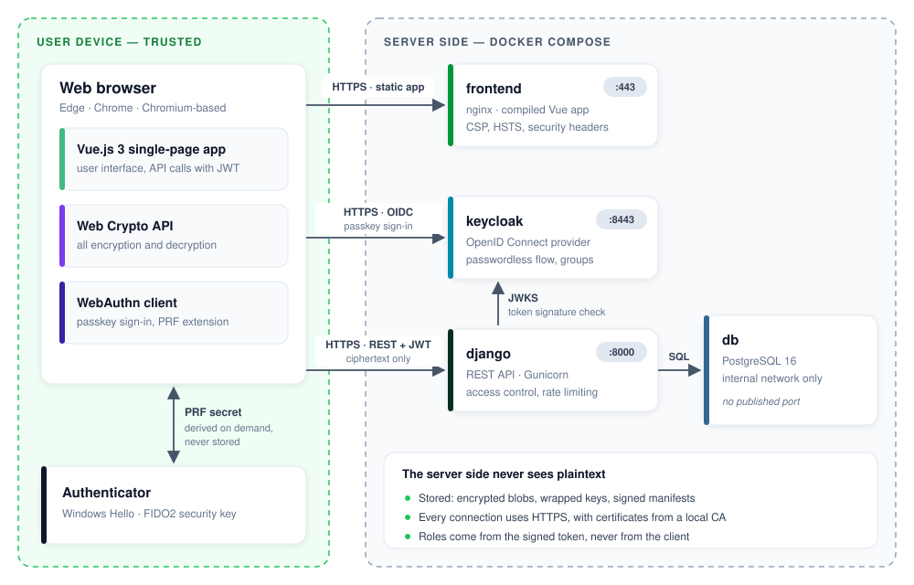
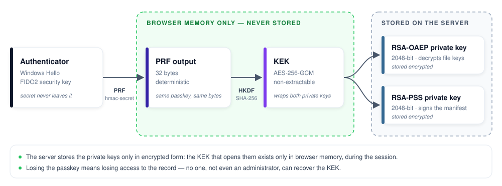
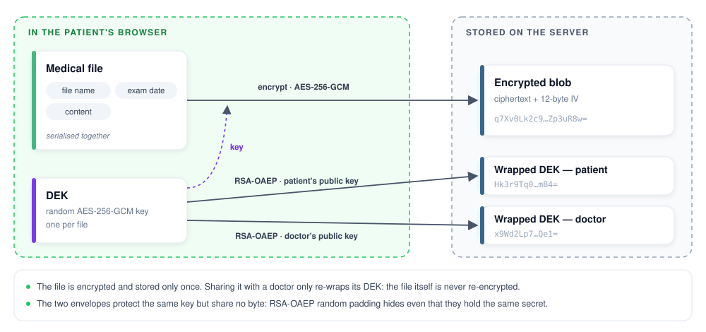

<div align="center">

# Hospital Security

**End-to-end encrypted medical records platform — passwordless sign-in with WebAuthn, encryption keys derived from the user's authenticator, and a server that cannot read a single byte of medical data.**


</div>

> [!NOTE]
> This README is being rewritten. Installation and usage instructions are currently available in
> [`5SEC1AL_2025-2026_Projet_Groupe31_ThemeHospital/README.md`](5SEC1AL_2025-2026_Projet_Groupe31_ThemeHospital/README.md).


## About

**Hospital Security** is a client/server application for managing medical records. A **patient** uploads,
views, updates and deletes the files of their medical record, and decides which **doctors** may access it.
An authorised doctor can read the record and propose to add, replace or delete a file — every proposal
requires the patient's explicit approval.

**The server cannot read any medical content.** All encryption and decryption happen in the browser: the
server only stores encrypted blobs and keys that are themselves encrypted, which it has no way to open.
Even file names and exam dates are encrypted together with the content.

Sign-in is **passwordless**, with WebAuthn passkeys. The key that protects each user's private keys is
derived from their authenticator through the WebAuthn **PRF** extension: it is never stored, neither on the
server nor on disk.

> **Context** — Academic team project carried out at HE2B ESI (Brussels) by **Georges Mouratidis** and
> **Ian Grande** for the Security course (2025-2026), with a strong focus on end-to-end encryption,
> passwordless authentication and a documented threat model.


## Features

- **Passwordless authentication** — sign-up and sign-in with WebAuthn passkeys (Windows Hello, FIDO2 security
  keys) through Keycloak and OpenID Connect. The patient role is assigned automatically; the doctor role can
  only be granted by the organisation.
- **Client-side end-to-end encryption** — every file is encrypted in the browser with its own AES-256-GCM key
  before being uploaded. File name, exam date and content are encrypted together in a single blob.
- **Keys bound to the authenticator** — the key that protects each user's private keys is derived from their
  authenticator (WebAuthn PRF + HKDF-SHA256). It is non-extractable and never stored anywhere.
- **Medical record management** — the patient uploads, views, replaces and deletes the files of their record.
- **Consent-based sharing** — the patient authorises or revokes doctors. When access is granted, the browser
  re-encrypts each file key for the doctor (RSA-OAEP); the file itself is stored only once.
- **Doctor proposals under patient control** — an authorised doctor can propose to add, replace or delete a
  file. Nothing enters the record until the patient approves and countersigns it.
- **Tamper-evident record** — a manifest signed by the patient (RSA-PSS) detects any file removed or added by
  the server, and a monotonic version counter prevents the replay of an older manifest.
- **Hardened deployment** — HTTPS everywhere through a local certificate authority, strict CSP, HSTS, rate
  limiting, brute-force detection in Keycloak, and a one-command installation that generates random secrets.


## Tech stack

| Area             | Technology                                                                          |
|------------------|-------------------------------------------------------------------------------------|
| Frontend         | Vue.js 3 (Options API), Vite — served by nginx                   |
| Cryptography     | Web Crypto API — AES-256-GCM, RSA-OAEP, RSA-PSS, HKDF-SHA256                        |
| Authentication   | Keycloak 26 (OpenID Connect), WebAuthn passkeys with the PRF extension              |
| Backend          | Python 3.12, Django 6.1, Django REST Framework, Gunicorn                            |
| Token validation | PyJWT — JWT signatures checked against Keycloak's public keys (JWKS)                |
| Database         | PostgreSQL 16                                                                       |
| Infrastructure   | Docker Compose, local certificate authority generated with OpenSSL                  |
| Documentation    | Sphinx (backend), JSDoc (frontend)                                                  |
| Tests            | Django test runner, Vitest, Vue Test Utils                                          |


## Architecture

The application runs as four Docker Compose services. The browser is the only place where medical data
exists in plaintext: it encrypts and decrypts everything locally and only exchanges ciphertext with the server.



| Service    | Role                                                        | Port                      |
|------------|-------------------------------------------------------------|---------------------------|
| `frontend` | Compiled Vue.js 3 app served by nginx, with security headers | 443 (80 redirects to 443) |
| `django`   | REST API served by Gunicorn, which terminates TLS itself    | 8000                      |
| `keycloak` | OpenID Connect identity provider, passwordless flow         | 8443                      |
| `db`       | PostgreSQL 16, reachable only from the internal network     | —                         |

All communications use HTTPS, without exception. The Keycloak realm (passwordless flow, client, groups and
WebAuthn policy) is imported automatically at first startup.


## Security design

### Key derivation

Sign-in is passwordless, and so is the protection of the keys. When a user unlocks their keys, the browser asks
the authenticator for a PRF output: 32 deterministic bytes that only this passkey can produce. HKDF-SHA-256 turns
them into a non-extractable AES-256-GCM key-encryption key (KEK), which decrypts the user's two RSA private keys:
one to decrypt file keys, one to sign the manifest. The server keeps these private keys, but only in encrypted
form, and has no way to open them.



### Envelope encryption

Each file gets its own random data-encryption key (DEK). The file name, exam date and content are serialised
together and encrypted once with AES-256-GCM, so the server does not even know the names of the documents it
hosts. The DEK is then wrapped with RSA-OAEP for each person allowed to read the file: granting access to a doctor
adds an envelope, and revoking it deletes the envelope.




### Signed manifest

Encryption protects each file, but not the list of files. A compromised server could silently delete an
inconvenient exam or add a forged document, and every remaining file would still decrypt correctly. Each record
therefore has a manifest (the list of file identifiers and a version counter) signed with the patient's RSA-PSS
private key. The client verifies the signature, then compares the signed list with the list actually delivered,
in both directions, so that both removals and additions are detected. The server rejects any manifest whose
version does not increase, which blocks the replay of an older, validly signed manifest.

### Access control

- **Deny by default** — every endpoint requires a valid token unless explicitly stated otherwise.
- **Role from the token** — the role is derived from the group carried by the signed token, never from a field
  sent by the client.
- **Object-level checks** — a doctor approved for patient A cannot read the files of patient B.
- **404, not 403** — unauthorised access to a file returns `404 Not Found`: a `403` would confirm to an attacker
  that the file exists.

### Server authentication

The server's public key is carried by its X.509 certificate, signed by a local certificate authority created at
installation. The CA certificate is **transferred out of band**: it is generated on the machine that runs the
project and installed manually in the system trust store, never downloaded from the server itself. On every
connection, the browser checks the signature chain and that the requested hostname appears in the certificate's
`subjectAltName`, and refuses the connection if either check fails. In production, a public CA would replace the
local one; the mechanism stays the same.

### Hardening

`DEBUG=False`, Gunicorn instead of a development server (no interactive debugger), Django admin disabled outside
development, HSTS, strict Content Security Policy, secure cookies, rate limiting with a counter shared between
workers, brute-force detection in Keycloak and full OpenID Connect logout.


## Project structure

```text
hospital-security/
├── README.md
├── docs/images/                                # Diagrams used in this README
└── 5SEC1AL_2025-2026_Projet_Groupe31_ThemeHospital/
    ├── install.sh                              # One-command installation: secrets, certificates, containers
    ├── docker-compose.yml                      # The four services
    ├── .env.example                            # Configuration template (secrets are generated by install.sh)
    ├── Vagrantfile                             # Clean Ubuntu 22.04 VM to test the installation from scratch
    ├── certs/
    │   ├── generate-certs.sh                   # Local certificate authority and server certificate
    │   └── server.ext                          # subjectAltName of the server certificate
    ├── keycloak/import/
    │   └── hospital-realm.json                 # Realm imported at first startup
    ├── backend/                                # Django REST API
    │   ├── config/                             # Settings (security hardening), URLs, WSGI
    │   ├── accounts/                           # Keycloak token authentication, profiles, public keys,
    │   │                                       # doctor-patient links, permissions, rate limiting
    │   ├── records/                            # Encrypted files, wrapped keys, signed manifests
    │   └── docs/                               # Sphinx configuration
    ├── frontend/                               # Vue.js 3 application
    │   ├── nginx.conf                          # HTTPS, CSP and security headers
    │   └── src/
    │       ├── crypto/
    │       │   ├── keys.js                     # PRF, HKDF, KEK, RSA key pairs, signatures
    │       │   └── files.js                    # Envelope encryption of the documents
    │       ├── services/                       # API client, authentication, enrollment, records,
    │       │                                   # doctors, approvals
    │       └── __tests__/                      # Vitest unit tests of the crypto modules
    ├── docs/                                   # Security checklist answers, Vagrant demo notes (French)
    └── *_medical_records_*.txt                 # Fictitious sample documents for testing
```


## Getting started

### Prerequisites

- **Docker Engine** with the **Docker Compose v2** plugin (Docker Desktop on Windows)
- **OpenSSL** (provided by Git for Windows on Windows)
- A recent **Chromium-based browser**: Microsoft Edge or Google Chrome
- A **WebAuthn authenticator supporting the PRF extension** — see [Authenticator requirements](#authenticator-requirements)

On Ubuntu, `install.sh` installs Docker and OpenSSL if they are missing.

### Installation

**Ubuntu 22.04**

```bash
git clone https://github.com/MGpro-grammer/hospital-security.git
cd hospital-security/5SEC1AL_2025-2026_Projet_Groupe31_ThemeHospital
chmod +x install.sh
./install.sh
```

**Windows 10/11 (PowerShell)** — requires Docker Desktop (started) and Git for Windows.

```powershell
git clone https://github.com/MGpro-grammer/hospital-security.git
cd hospital-security\5SEC1AL_2025-2026_Projet_Groupe31_ThemeHospital
& "C:\Program Files\Git\bin\bash.exe" install.sh
```

> [!NOTE]
> On Windows, call Git Bash explicitly as shown above: a plain `bash` command may start the WSL shell instead,
> which runs in a different environment.

The script is idempotent and can safely be run again. It:

1. installs the missing dependencies (Ubuntu only);
2. creates `.env` from `.env.example`, with a randomly generated `SECRET_KEY`, `POSTGRES_PASSWORD` and
   `KEYCLOAK_ADMIN_PASSWORD`;
3. generates the local certificate authority and the server certificate;
4. builds the images and starts the four services;
5. applies the database migrations and creates the cache table.

### Trust the local certificate authority

This step is **required**. Without it, the browser shows a security warning and, above all, **WebAuthn refuses
to work**: it only runs in a secure context.

**Windows (PowerShell, from the project folder)** — the `CurrentUser` store requires no administrator rights:

```powershell
Import-Certificate -FilePath .\certs\ca.crt -CertStoreLocation Cert:\CurrentUser\Root
```

**Ubuntu — system store**

```bash
sudo cp certs/ca.crt /usr/local/share/ca-certificates/hospital-security-ca.crt
sudo update-ca-certificates
```

**Ubuntu — Chrome / Chromium**, which uses its own NSS database on Linux:

```bash
sudo apt-get install -y libnss3-tools
certutil -d sql:$HOME/.pki/nssdb -A -t "C,," -n "Hospital Security CA" -i certs/ca.crt
```

Restart the browser completely, then open **https://localhost**: the padlock must be closed, with no warning.

